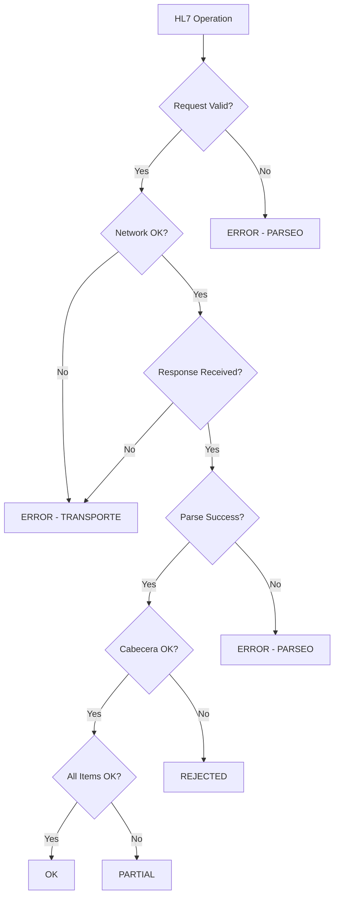

The result types provide a type-safe wrapper for HL7 operation results, distinguishing between successful operations, partial successes, functional rejections, and technical errors.

## Hl7Result\<T\>

Generic result wrapper that encapsulates the outcome of an HL7 operation.

**Package:** `com.hl7client.model.result`

### Type Parameters

<ParamField path="T" type="Type">
  The type of data contained in the result (typically a response DTO)
</ParamField>

### Fields

<ResponseField name="status" type="Hl7Status" required>
  The operation status (OK, PARTIAL, REJECTED, or ERROR)
</ResponseField>

<ResponseField name="data" type="T">
  The response data (present for OK, PARTIAL, and REJECTED statuses)
</ResponseField>

<ResponseField name="issue" type="Hl7Error">
  Error information (present for REJECTED and ERROR statuses)
</ResponseField>

<ResponseField name="details" type="List<Hl7ItemError>">
  List of item-level errors (present for PARTIAL status)
</ResponseField>

### Factory Methods

#### ok()

Creates a successful result with data and no errors.

```java
public static <T> Hl7Result<T> ok(T data)
```

<ParamField path="data" type="T" required>
  The successful response data
</ParamField>

**Returns:** `Hl7Result<T>` with status `OK`

**Example:**

```java
ElegibilidadResponse response = // ... parse response
return Hl7Result.ok(response);
```

#### partial()

Creates a partially successful result with data and item-level warnings/errors.

```java
public static <T> Hl7Result<T> partial(
    T data,
    List<Hl7ItemError> details
)
```

<ParamField path="data" type="T" required>
  The response data (cannot be null)
</ParamField>

<ParamField path="details" type="List<Hl7ItemError>" required>
  List of item-level errors or warnings
</ParamField>

**Returns:** `Hl7Result<T>` with status `PARTIAL`

**Example:**

```java
List<Hl7ItemError> errors = new ArrayList<>();
for (RegistracionDetalle item : response.getDetalle()) {
    if (item.getRecha() != 0) {
        errors.add(new Hl7ItemError(
            String.valueOf(item.getRecha()),
            item.getDenoItem(),
            Hl7ItemErrorOrigin.DETALLE
        ));
    }
}

if (!errors.isEmpty()) {
    return Hl7Result.partial(response, errors);
}
```

#### rejected()

Creates a functionally rejected result (business rules violation).

```java
public static <T> Hl7Result<T> rejected(
    T data,
    Hl7Error functionalError
)
```

<ParamField path="data" type="T" required>
  The response data containing rejection information
</ParamField>

<ParamField path="functionalError" type="Hl7Error" required>
  The functional rejection error
</ParamField>

**Returns:** `Hl7Result<T>` with status `REJECTED`

**Example:**

```java
if (cabecera.getRechaCabecera() != 0) {
    Hl7Error error = Hl7Error.functional(
        String.valueOf(cabecera.getRechaCabecera()),
        cabecera.getRechaCabeDeno()
    );
    return Hl7Result.rejected(response, error);
}
```

#### error()

Creates a technical error result (infrastructure/communication failure).

```java
public static <T> Hl7Result<T> error(Hl7Error technicalError)
```

<ParamField path="technicalError" type="Hl7Error" required>
  The technical error details
</ParamField>

**Returns:** `Hl7Result<T>` with status `ERROR` and no data

**Example:**

```java
try {
    // ... make API call
} catch (IOException e) {
    return Hl7Result.error(
        Hl7Error.technical(
            "Network error: " + e.getMessage(),
            Hl7ErrorOrigin.TRANSPORTE
        )
    );
}
```

### Helper Methods

<ResponseField name="isOk()" type="boolean">
  Returns `true` if status is `OK`
</ResponseField>

<ResponseField name="isPartial()" type="boolean">
  Returns `true` if status is `PARTIAL`
</ResponseField>

<ResponseField name="isRejected()" type="boolean">
  Returns `true` if status is `REJECTED`
</ResponseField>

<ResponseField name="isError()" type="boolean">
  Returns `true` if status is `ERROR`
</ResponseField>

### Accessor Methods

<ResponseField name="getStatus()" type="Hl7Status">
  Returns the operation status
</ResponseField>

<ResponseField name="getData()" type="Optional<T>">
  Returns the data wrapped in an `Optional`
</ResponseField>

<ResponseField name="getIssue()" type="Optional<Hl7Error>">
  Returns the error wrapped in an `Optional`
</ResponseField>

<ResponseField name="getDetails()" type="List<Hl7ItemError>">
  Returns an immutable list of item-level errors
</ResponseField>

### Usage Example

```java
Hl7Result<ElegibilidadResponse> result = hl7Service.checkElegibilidad(request);

if (result.isOk()) {
    ElegibilidadResponse response = result.getData().get();
    // Process successful response
    displayPatientInfo(response);
    
} else if (result.isPartial()) {
    ElegibilidadResponse response = result.getData().get();
    // Process response with warnings
    displayPatientInfo(response);
    
    for (Hl7ItemError detail : result.getDetails()) {
        logger.warn("Item warning: {}", detail.getMessage());
    }
    
} else if (result.isRejected()) {
    // Handle business rule rejection
    Hl7Error error = result.getIssue().get();
    showError("Request rejected: " + error.getMessage());
    
    if (error.isSession()) {
        // Prompt for re-login
        redirectToLogin();
    }
    
} else if (result.isError()) {
    // Handle technical error
    Hl7Error error = result.getIssue().get();
    logger.error("Technical error: {}", error.getMessage());
    showError("System error. Please try again.");
}
```

## Hl7Status

Enumeration of possible operation statuses.

**Package:** `com.hl7client.model.result`

<ResponseField name="OK" type="Hl7Status">
  Operation completed successfully with no issues
</ResponseField>

<ResponseField name="PARTIAL" type="Hl7Status">
  Operation completed with some items having warnings or errors
</ResponseField>

<ResponseField name="REJECTED" type="Hl7Status">
  Operation rejected due to business rules violation
</ResponseField>

<ResponseField name="ERROR" type="Hl7Status">
  Operation failed due to technical error (network, session, parsing, etc.)
</ResponseField>

### Status Flow Diagram



## Hl7Error

Represents an error at the operation level (header/cabecera).

**Package:** `com.hl7client.model.result`

### Fields

<ResponseField name="code" type="String">
  Error code (may be `null` for technical errors)
</ResponseField>

<ResponseField name="message" type="String" required>
  Human-readable error message
</ResponseField>

<ResponseField name="origin" type="Hl7ErrorOrigin" required>
  The origin/layer where the error occurred
</ResponseField>

<ResponseField name="session" type="boolean">
  Whether this is a session expiration error
</ResponseField>

### Factory Methods

#### functional()

Creates a functional/business rule error.

```java
public static Hl7Error functional(String code, String message)
```

<ParamField path="code" type="String" required>
  Error code from the HL7 provider
</ParamField>

<ParamField path="message" type="String" required>
  Error message from the HL7 provider
</ParamField>

**Returns:** `Hl7Error` with origin `CABECERA`

**Example:**

```java
Hl7Error error = Hl7Error.functional(
    "2001",
    "Credencial no encontrada"
);
```

#### technical()

Creates a technical/infrastructure error.

```java
public static Hl7Error technical(String message, Hl7ErrorOrigin origin)
```

<ParamField path="message" type="String" required>
  Error description
</ParamField>

<ParamField path="origin" type="Hl7ErrorOrigin" required>
  The layer where the error occurred
</ParamField>

**Returns:** `Hl7Error` with no code

**Example:**

```java
Hl7Error error = Hl7Error.technical(
    "Connection timeout",
    Hl7ErrorOrigin.TRANSPORTE
);
```

#### sessionExpired()

Creates a session expiration error.

```java
public static Hl7Error sessionExpired()
```

**Returns:** `Hl7Error` with predefined session error details

**Example:**

```java
if (response.getStatusCode() == 401) {
    return Hl7Result.error(Hl7Error.sessionExpired());
}
```

### Methods

<ResponseField name="isSession()" type="boolean">
  Returns `true` if this is a session expiration error
</ResponseField>

<ResponseField name="getCode()" type="String">
  Returns the error code (may be `null`)
</ResponseField>

<ResponseField name="getMessage()" type="String">
  Returns the error message
</ResponseField>

<ResponseField name="getOrigin()" type="Hl7ErrorOrigin">
  Returns the error origin
</ResponseField>

## Hl7ErrorOrigin

Enumeration of error origin layers.

**Package:** `com.hl7client.model.result`

<ResponseField name="CABECERA" type="Hl7ErrorOrigin">
  Error in the response header/cabecera (functional rejection)
</ResponseField>

<ResponseField name="DETALLE" type="Hl7ErrorOrigin">
  Error in response detail items
</ResponseField>

<ResponseField name="TRANSPORTE" type="Hl7ErrorOrigin">
  Network or HTTP transport error
</ResponseField>

<ResponseField name="PARSEO" type="Hl7ErrorOrigin">
  JSON parsing or deserialization error
</ResponseField>

### Error Origin Examples

<Expandable title="TRANSPORTE - Network Errors">
  ```java
  // Connection timeout
  Hl7Error.technical(
      "Connection timeout after 30s",
      Hl7ErrorOrigin.TRANSPORTE
  )
  
  // HTTP error
  Hl7Error.technical(
      "HTTP 500: Internal Server Error",
      Hl7ErrorOrigin.TRANSPORTE
  )
  
  // SSL error
  Hl7Error.technical(
      "SSL handshake failed",
      Hl7ErrorOrigin.TRANSPORTE
  )
  ```
</Expandable>

<Expandable title="PARSEO - Parsing Errors">
  ```java
  // Invalid JSON
  Hl7Error.technical(
      "Invalid JSON: unexpected token at line 5",
      Hl7ErrorOrigin.PARSEO
  )
  
  // Missing required field
  Hl7Error.technical(
      "Missing required field 'cabecera'",
      Hl7ErrorOrigin.PARSEO
  )
  
  // Type mismatch
  Hl7Error.technical(
      "Expected number but got string for field 'edad'",
      Hl7ErrorOrigin.PARSEO
  )
  ```
</Expandable>

<Expandable title="CABECERA - Functional Errors">
  ```java
  // Business rule rejection
  Hl7Error.functional(
      "2001",
      "Credencial no encontrada"
  )
  
  // Coverage issue
  Hl7Error.functional(
      "3005",
      "Plan no cubre la prestación solicitada"
  )
  ```
</Expandable>

## Hl7ItemError

Represents an error at the item/detail level.

**Package:** `com.hl7client.model.result`

### Constructor

```java
public Hl7ItemError(
    String code,
    String message,
    Hl7ItemErrorOrigin origin
)
```

<ParamField path="code" type="String" required>
  Error code
</ParamField>

<ParamField path="message" type="String" required>
  Error message
</ParamField>

<ParamField path="origin" type="Hl7ItemErrorOrigin" required>
  The detail level where the error occurred
</ParamField>

### Methods

<ResponseField name="getCode()" type="String">
  Returns the error code
</ResponseField>

<ResponseField name="getMessage()" type="String">
  Returns the error message
</ResponseField>

<ResponseField name="getOrigin()" type="Hl7ItemErrorOrigin">
  Returns the error origin
</ResponseField>

### Example

```java
List<Hl7ItemError> errors = new ArrayList<>();

for (RegistracionDetalle item : response.getDetalle()) {
    if (item.getRecha() != 0) {
        errors.add(new Hl7ItemError(
            String.valueOf(item.getRecha()),
            item.getDenoItem(),
            Hl7ItemErrorOrigin.DETALLE
        ));
    }
}

if (!errors.isEmpty()) {
    return Hl7Result.partial(response, errors);
}
```

## Hl7ItemErrorOrigin

Enumeration of item-level error origins.

**Package:** `com.hl7client.model.result`

<ResponseField name="DETALLE" type="Hl7ItemErrorOrigin">
  Error in a detail item (main item level)
</ResponseField>

<ResponseField name="SUBDETALLE" type="Hl7ItemErrorOrigin">
  Error in a sub-detail item (nested items like practices, supplies, etc.)
</ResponseField>

<Note>
  Currently, only `DETALLE` is actively used in the client implementation.
</Note>

## Complete Example

Here's a complete example showing how to use all result types together:

```java
public Hl7Result<RegistracionResponse> registrarServicios(
    RegistracionRequest request
) {
    try {
        // Make API call
        HttpResponse<String> httpResponse = httpClient.send(
            buildRequest(request),
            HttpResponse.BodyHandlers.ofString()
        );
        
        // Check session
        if (httpResponse.statusCode() == 401) {
            return Hl7Result.error(Hl7Error.sessionExpired());
        }
        
        // Check transport errors
        if (httpResponse.statusCode() >= 500) {
            return Hl7Result.error(
                Hl7Error.technical(
                    "Server error: " + httpResponse.statusCode(),
                    Hl7ErrorOrigin.TRANSPORTE
                )
            );
        }
        
        // Parse response
        RegistracionResponse response;
        try {
            response = objectMapper.readValue(
                httpResponse.body(),
                RegistracionResponse.class
            );
        } catch (JsonProcessingException e) {
            return Hl7Result.error(
                Hl7Error.technical(
                    "Parse error: " + e.getMessage(),
                    Hl7ErrorOrigin.PARSEO
                )
            );
        }
        
        // Check cabecera rejection
        RegistracionCabecera cabecera = response.getCabecera();
        if (cabecera.getRechaCabecera() != 0) {
            return Hl7Result.rejected(
                response,
                Hl7Error.functional(
                    String.valueOf(cabecera.getRechaCabecera()),
                    cabecera.getRechaCabeDeno()
                )
            );
        }
        
        // Check for partial success (item-level errors)
        if (response.getDetalle() != null) {
            List<Hl7ItemError> errors = new ArrayList<>();
            
            for (RegistracionDetalle item : response.getDetalle()) {
                if (item.getRecha() != 0) {
                    errors.add(new Hl7ItemError(
                        String.valueOf(item.getRecha()),
                        item.getDenoItem(),
                        Hl7ItemErrorOrigin.DETALLE
                    ));
                }
            }
            
            if (!errors.isEmpty()) {
                return Hl7Result.partial(response, errors);
            }
        }
        
        // Complete success
        return Hl7Result.ok(response);
        
    } catch (IOException e) {
        return Hl7Result.error(
            Hl7Error.technical(
                "Network error: " + e.getMessage(),
                Hl7ErrorOrigin.TRANSPORTE
            )
        );
    } catch (InterruptedException e) {
        Thread.currentThread().interrupt();
        return Hl7Result.error(
            Hl7Error.technical(
                "Request interrupted",
                Hl7ErrorOrigin.TRANSPORTE
            )
        );
    }
}
```
